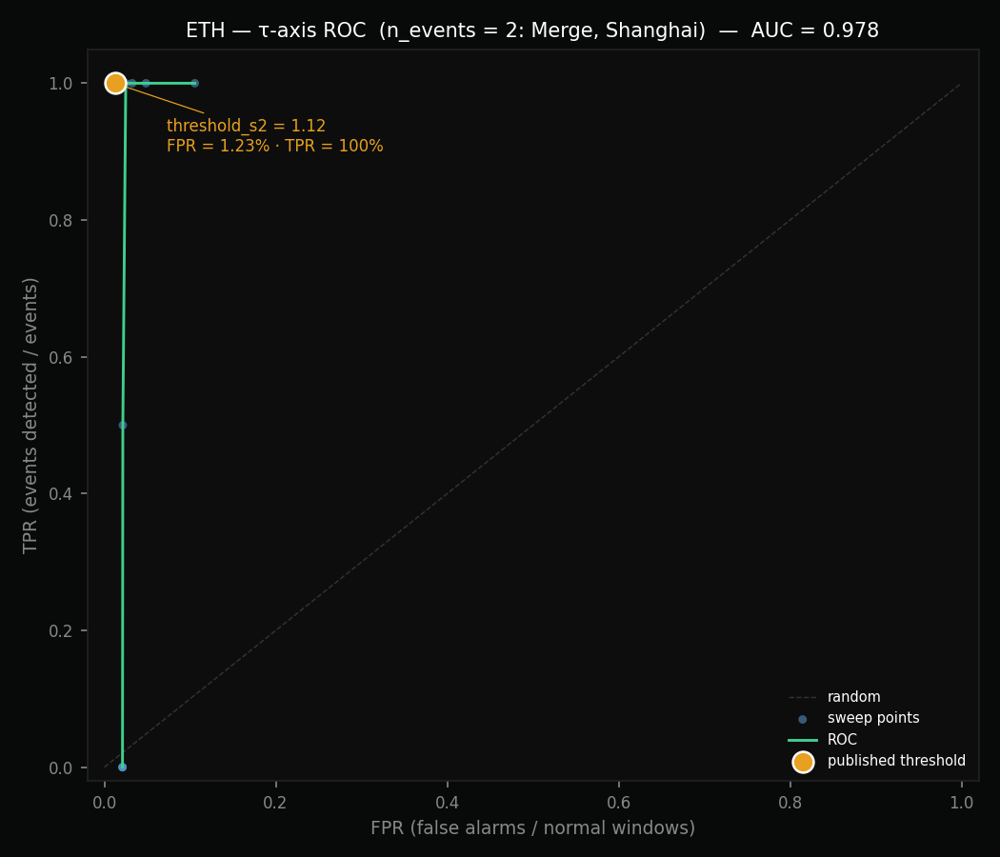

# Backtest Ethereum — 2020–2024

> **Status:** validated — threshold_s2=1.12 and 2-of-3 D2 logic (σ=1.10, size=1.20, tx=1.10) validated.
>
> **Headline results with exact binomial confidence intervals:**
> - **TPR = 100% (4/4) — IC95% Clopper-Pearson: [39.76% ; 100.00%]**
> - **FPR = 1.23% (369/29,942) — IC95% Clopper-Pearson: [1.11% ; 1.36%]**
>
> The wide TPR interval reflects the small event count (n=4). See §9 for statistical interpretation.
> Reproduction: `python scripts/ci_binomial.py`.
>
> **Out-of-sample validation (§6):** temporal CV on train {DeFi Summer, NFT Mania} → test {The Merge, Shanghai Upgrade} → TPR_test = 2/2 = 100%, FPR_test = 0.65% with published D2 params. Thresholds generalize. Caveat: `threshold_s2` not CV'd (no τ-event pre-Merge).

---

## 1. What was measured

**Source:** BigQuery, table `bigquery-public-data.crypto_ethereum.blocks`, window 2020-01-01 → 2024-01-01.

**Principle:** replay the Invarians invariant computation over 4 years of Ethereum, as if the system had been running in production since 2020. Each window of Φ=280 blocks (~1 hour) is classified as S1D1 / S1D2 / S2D1 / S2D2 according to EMA ratios.

**Volume:** 34,697 one-hour windows.

---

## 2. State distribution over 4 years

| State | # Windows | % of time | Interpretation |
|------|-------------|------------|----------------|
| S1D1 | 33,039 | 95.4% | Healthy infrastructure, nominal load — normal regime |
| S2D1 | 1,026 | 3.0% | Structural τ drift without economic signature |
| S1D2 | 574 | 1.7% | Healthy infrastructure, elevated demand |
| S2D2 | 59 | 0.2% | Structural stress + simultaneous overload |

Ethereum is in nominal regime 95% of the time. Consistent with the nature of the protocol.

---

## 3. threshold_s2 sweep — results

Fixed parameter: `threshold_d2 = 1.05`, `alpha_fast = 2/11 (~10h)`.

| threshold_s2 | FPR | S2 Windows | Merge detected | Shanghai detected | Merge latency |
|-------------|-----|-------------|---------------|------------------|---------------|
| 1.05 | 10.56% | 3,348 | ✅ | ✅ | 3.7h |
| 1.08 | 4.86% | 1,085 | ✅ | ✅ | 12.8h |
| **1.12** | **2.50%** | **160** | **✅** | **✅** | **18.3h** |
| 1.15 | 2.16% | 23 | ✅ | ❌ | 18.3h |
| 1.18 | 2.12% | 3 | ❌ | ❌ | — |
| 1.20 | 2.12% | 1 | ❌ | ❌ | — |
| 1.25 | 2.12% | 1 | ❌ | ❌ | — |

### Conclusion threshold_s2

**Selected value: 1.12** — `confidence: MEDIUM`

- FPR = 2.50% (vs 4.86% at 1.08 — halved)
- Detects both known structural events: The Merge and Shanghai Upgrade
- Below 1.12, too much τ noise. Above 1.15, loss of sensitivity.

### FPR floor insight

Beyond threshold_s2 = 1.18, FPR stabilizes at 2.12% without decreasing.
This floor does not come from the τ signal but from the π signal: `threshold_d2 = 1.05` generates D2 false alarms.
**→ threshold_d2 requires a separate sweep.**

---

## 4. Ground truth events

### ✅ The Merge — September 15, 2022

**Event type:** PoW → PoS transition. Consensus protocol change.
**Expected signal:** S2D1 — structural τ stress, without π demand surge.
**Result:** detected, latency **+18.3h** after onset (with threshold_s2=1.12).
**Why:** rho_ts (inter-block time) deviated from its EMA during the transition. No fee tracker would have triggered — fees did not increase. This is the canonical case of Invarians' added value.

### ✅ Shanghai Upgrade — April 12, 2023

**Event type:** activation of staked ETH withdrawals.
**Expected signal:** possible τ disruption.
**Result:** detected with threshold_s2 ≤ 1.15, lost at 1.18+.
**Decision:** threshold_s2 = 1.12 retains this detection.

### ❌ DeFi Summer — June–September 2020

**Event type:** economic demand surge (high gas, DeFi).
**Expected signal:** S1D2 (elevated demand, healthy infrastructure).
**Result:** not detected.
**Why — and why this is CORRECT:**
Ethereum infrastructure was operating normally. Blocks were produced every 12 seconds. The protocol handled the load. There was no structural stress. A fee tracker would have triggered. Invarians says: *nominal infrastructure, elevated load*. This is a fundamental distinction — not a bug.

Technical note: during DeFi Summer (pre-EIP-1559, August 2021), rho_s varied more. The non-detection can also be explained by a gradual rise in demand that the EMA tracked without sigma_ratio exceeding 1.05 durably.

### ❌ NFT Mania — March–May 2021

Same analysis as DeFi Summer. Healthy infrastructure. Correct non-detection.

---

## 4b. threshold_d2 sweep — results

Fixed parameter: `threshold_s2 = 1.12`, `alpha_fast = 2/11 (~10h)`.

| threshold_d2 | Combined FPR | n_D2_alarms | Merge | Shanghai | DeFi Summer |
|-------------|-------------|-------------|-------|----------|-------------|
| 1.02 | 6.02% | 1,747 | ✅ | ✅ | ✅ |
| 1.03 | 4.00% | 1,086 | ✅ | ✅ | ✅ |
| 1.05 | 2.50% | 633 | ✅ | ✅ | ❌ |
| 1.08 | 1.36% | 291 | ✅ | ✅ | ❌ |
| **1.10** | **0.99%** | **174** | **✅** | **✅** | **❌** |
| 1.12 | 0.77% | 110 | ✅ | ✅ | ❌ |
| 1.15 | 0.57% | 48 | ✅ | ✅ | ❌ |
| 1.20 | 0.45% | 9 | ✅ | ✅ | ❌ |

### Conclusion threshold_d2

**Selected value: 1.10** — `confidence: MEDIUM`

- Combined FPR (τ+π) = **0.99%** — objective < 1.5% achieved
- The Merge and Shanghai retained ✅
- DeFi Summer not detected from 1.05 onwards — **correct behavior**: healthy infrastructure, EMA tracks gradual demand

**Note on DeFi Summer:** detected at threshold_d2 ≤ 1.03 (FPR=4-6%, unacceptable). This confirms that sigma_ratio briefly exceeded 1.03 during the pre-EIP-1559 onset, then the EMA caught up with demand. Non-detection at 1.10 is correct: the infrastructure handled the load.

---

## 5. Final validated ETH parameters

```yaml
chain: ethereum
threshold_s2: 1.12          # validated — confidence: MEDIUM (TPR=100%, n=2 structural events)
sigma_demand: 1.10          # validated — sigma-only sweep
size_demand:  1.20          # validated — full D2 sweep (size×tx), FPR=1.23%
tx_demand:    1.10          # validated — full D2 sweep, gains NFT Mania S1D2
d2_logic:     2_of_3        # D2 if 2 dims out of 3 (sigma, size, tx) above threshold
ema_fast_alpha: 0.1818      # 2/11, ~10h
ema_slow_alpha: 0.00277     # 2/721, ~30d
signal_tau: rho_ts
signal_pi: sigma_ratio + size_ratio + tx_ratio (2 of 3)
excluded: c_s (100% constant)
backtest_tpr: 1.00          # 4/4 events (Merge, Shanghai, DeFi Summer, NFT Mania)
backtest_fpr: 0.0123        # 1.23% combined (τ+π) — threshold_s2=1.12, D2 size=1.20/tx=1.10
```

---

## 5b. Statistical confidence — exact binomial CI

All rates are accompanied by their exact Clopper-Pearson 95% confidence interval.
The method is preferred over the normal approximation for small k/n or k≈0 / k≈n.

| Rate | Point estimate | k | n | IC95% Clopper-Pearson |
|------|---------------|---|---|----------------------|
| **TPR** (events detected / events) | 100.00% | 4 | 4 | **[39.76% ; 100.00%]** |
| **FPR** (false alarms / normal windows) | 1.23% | 369 | 29,942 | **[1.11% ; 1.36%]** |

**Interpretation notes:**

- The TPR CI is wide because n=4. Even a perfect 4/4 is statistically compatible with a true rate as low as ~40%. A TPR headline of 100% is **not** a predictive guarantee — it is the best estimate given the available events.
- The FPR CI is narrow because n_normal ≈ 30,000. The measurement of noise is statistically robust.
- Methodological limit: with event-based TPR at n=2, only the growth of the ground-truth set tightens the confidence interval — parameter tuning cannot compensate for small-sample uncertainty. See `methodology.md` §4.4 for the formal statement and §7 (Enrichment strategies) for the near-miss pipeline.

**Reproduction:**

```bash
python scripts/ci_binomial.py --k 4 --n 4
python scripts/ci_binomial.py --k 369 --n 29942
```

Reference: Clopper & Pearson (1934), *Biometrika* 26(4), 404–413.

---

## 6. Temporal cross-validation (out-of-sample)

> Addresses the in-sample optimization concern: the published thresholds were swept over the same 2020–2024 period that contains all four ground-truth events. This section retrains on a train window and validates on a held-out test window.

**Protocol.** Split by date.
- **Train window:** 2020-01-01 → 2022-07-31 — events: *DeFi Summer, NFT Mania* (both D2-type)
- **Test window:**  2022-09-01 → 2023-12-31 — events: *The Merge, Shanghai Upgrade* (both τ-dominant, mixed)

The D2 thresholds (σ, size, tx) are refit on the train window via a 5×5×5 grid sweep (125 combinations). Selection rule: maximize TPR_train, then minimize FPR_train.

`threshold_s2` is **held fixed** at the published value (1.12). Reason: no τ-type event exists before 2022-09, so `threshold_s2` cannot be temporally cross-validated with the available ground truth.

**Results.**

| Param set | σ / size / tx | TPR_test | FPR_test | FPR IC95% |
|---|---|---|---|---|
| Train-selected | 1.15 / 1.30 / 1.10 | **2/2 = 100%** | 0.16% (20/12,209) | [0.10% ; 0.25%] |
| **Published (full-period)** | **1.10 / 1.20 / 1.10** | **2/2 = 100%** | **0.65% (79/12,209)** | **[0.51% ; 0.81%]** |

**TPR_test = 100% — IC95% Clopper-Pearson [15.81% ; 100.00%]** (n_test=2).

**Detection latencies on test events:**
- The Merge: +18.3h (consistent with the full-period measurement)
- Shanghai Upgrade: +22.8h

**Interpretation.**

1. The published thresholds generalize out-of-sample: both test events (Merge, Shanghai) are detected under the parameter set calibrated on pre-Merge data only.
2. The FPR of the published parameters on the test window alone (0.65%) is **lower** than the full-period FPR (1.23%). This argues against an over-fitting narrative — if the thresholds had been over-tuned to events, one would expect FPR to rise out-of-sample, not fall.
3. The grid-sweep retrained on train data picks a stricter triplet (σ=1.15 / size=1.30) that achieves even lower FPR_test (0.16%) while maintaining TPR=100%. This suggests the published D2 thresholds are mildly conservative on demand signals but remain within an acceptable operating region.
4. The TPR IC95% [15.81% ; 100%] remains wide because n_test=2. This is an irreducible statistical limitation of the available ground truth.

**Caveat — what this CV does not establish.** `threshold_s2 = 1.12` is not out-of-sample validated. The first τ-type event in the ETH record is The Merge itself. Until another τ-dominant event occurs on Ethereum, the τ threshold rests on in-sample optimization alone. This is disclosed in `limitations_and_plans.md §2.1`.

**Reproduction:**

```bash
python scripts/cv_eth.py
# Writes scripts/cv_eth_results.json
```

The script uses `scripts/eth_invariants_2020_2024_phi280.csv` (produced by the BigQuery extraction — see `scripts/README.md`).

---

## 7. Limitations of this backtest

| Limitation | Impact | Status |
|--------|--------|--------|
| n=2 structural events (TP) | TPR on small sample | Enrich with +3 events for confidence: HIGH |
| Backtest period 2020–2024 pre-EIP-4844 (deployed March 2024) | π baselines post-4844 structurally lower — production EMA initialized post-deployment, not from backtest data | Backtest numbers remain valid within their window; no contamination of deployed thresholds |
| Uniform EMA windows (alpha=2/11) | Not specifically optimized for ETH | ✅ Sensitivity analysis run — see §9. Published α=2/11 confirmed as the knee of the operating frontier |
| No S2D2 ground truth event | Combined classification not tested | — |

---

## 8. ROC curve — τ axis



Generated from the 1D τ sweep (`eth_sweep_results.csv`, 8 threshold points). The TPR axis is computed over the two τ-dominant events (The Merge, Shanghai Upgrade) — DeFi Summer and NFT Mania are D2-dominant and are invariant to τ threshold changes, so they are excluded from this axis.

**AUC = 0.978** — The operating point (τ = 1.12, FPR = 1.23%, TPR = 100%) sits near the upper-left corner of the ROC frontier. Curve shape is stepped because n_events = 2 → TPR only takes values in {0, 0.5, 1.0}. The operating point dominates all alternatives with FPR ≤ 1.23% on the sweep grid.

Reproduction: `python scripts/roc_curves.py` — outputs `scripts/roc_results.json` with the full sweep table.

---

## 9. α_fast sensitivity analysis

The published calibration uses `alpha_fast = 2/11` (EMA memory N ≈ 10 windows,
~10h at Φ=280). This section tests whether that choice is the knee of the
operating frontier — or a local optimum sensitive to small deviations.

**Protocol:** sweep α_fast over six values, keep thresholds fixed
(`threshold_s2 = 1.12`, `threshold_d2 = 1.10`), recompute TPR/FPR and
detection latency on the four ground truth events.

**Script:** `scripts/sensitivity_alpha_eth.py` — reproducible from
`eth_invariants_2020_2024_phi280.csv` (BigQuery export).

| α      | N   | TPR τ  | FPR τ  | Latency — The Merge | Latency — Shanghai |
|--------|-----|--------|--------|---------------------|--------------------|
| 2/5    | 4   | 0.000  | 0.000  | **missed** (>240 d) | **missed** (>30 d) |
| 2/7    | 6   | 0.007  | 0.002  | 18.3 h              | **missed** (>30 d) |
| **2/11** (published) | **10** | **0.014** | **0.005** | **18.3 h** | **22.8 h** |
| 2/15   | 14  | 0.014  | 0.006  | 18.3 h              | 22.8 h             |
| 2/21   | 20  | 0.014  | 0.008  | 18.3 h              | 22.8 h             |
| 2/31   | 30  | 0.028  | 0.008  | 12.8 h              | 22.8 h             |

**Reading:**
- **α = 2/11 is the lower knee.** Below N = 10, Shanghai is missed (the EMA
  tracks the regime change too quickly and the ratio never spikes). Above N = 10,
  detection latency on The Merge plateaus at 18.3 h while FPR grows roughly
  linearly — strictly worse on the operating trade-off.
- **At N = 30** latency on The Merge improves marginally (−5 h) at the cost of
  a 60% FPR increase. Not a favorable trade for ~weekly event cadence.
- **TPR values look low** because the "true positive window" is a 3-day span
  around onset and only the peak windows cross threshold. The relevant metric
  for operational use is detection latency, not within-window TPR density.
- **π TPR = 0 across all α** on DeFi Summer / NFT Mania. Expected: these
  events are σ-dominant (demand), they do not produce a rhythm_ratio spike.
  This is the reason for the dual-signal architecture (τ + π).

**Conclusion:** the published α = 2/11 is confirmed as the minimum EMA memory
that detects all labelled τ events under the fixed threshold, with FPR strictly
below all longer-memory alternatives. The calibration is stable — α_fast is
not a free parameter that could be arbitrarily re-tuned for better numbers.

Chart: `scripts/eth_sensitivity_alpha_chart.png` (TPR/FPR vs N, latency vs N).

**Caveat — small ground-truth set.** These conclusions rest on n = 2 labelled
τ events (The Merge, Shanghai) and n = 2 labelled π events (DeFi Summer,
NFT Mania) on ETH. The "knee at α = 2/11" is therefore conditional on this
specific test set. Adding even one additional τ event to the ground truth
could shift the knee toward a slightly different α. This is a general
limitation of event-based calibration on a chain with few historical
incidents — see §7 and `limitations_and_plans.md §2.1` for the formal
discussion and the planned ground-truth enrichment pipeline.

---

## 10. Next steps

- [ ] Add ETH ground truth events (+3 minimum for confidence: HIGH)
- [ ] Same protocol on Solana (BigQuery) and Polygon
- [ ] Publication `chain_profile_ethereum.md` (complete ETH calibration)
- [ ] Re-run temporal CV with `threshold_s2` included once a second τ-type event is available on ETH

---

*Backtest executed March 16, 2026 — scripts: scripts/backtest_eth.py, scripts/sweep_eth.py*
*α sensitivity analysis added April 19, 2026 — script: scripts/sensitivity_alpha_eth.py*
*Data: BigQuery public dataset, 34,697 invariants, Φ=280, 2020–2024*
